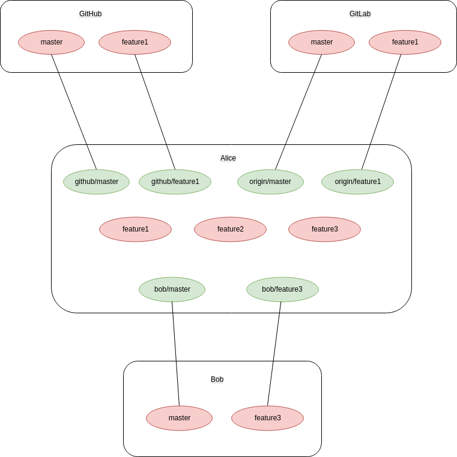

# Understand Git As a Distributed System

Let's say that Alice is the developer, she can pull changes/branches from multiple remotes such as GitHub, GitLab, and even another developer Bob. Our first remote will be, but not necessarily, named as `origin` by default, in fact, we can name it whatever we like.

Legend

* green: local copy of a remote branch, not necessary has extactly the same commits as the branch on the remote computer and therefore fetch/pull from remote is needed
* red: local branch, we very likely have some more commits during development

In GitExtensions, the remote branches are often colored green as well as prefixed with the remote name, for example `origin/master` in below image is the snapshot of the `master` branch we got from the remote `origin`

* GitHub's Fork Workflow

GitHub has a fork and pull request mode to encourage developers to contribute even when they don't have permission to commit to the original repository. For example Alice forked `GitExtensions` on GitHub to her own GitHub account as `Alice/GitExtensions`, she may set `Alice/GitExtensions` as the `origin` and the official `GitExtensions/GitExtensions` as `upstream`. Since she doesn't have permission to push to the official repository, she will only push commits to her own `Alice/GitExtensions`, and then create a pull request from `Alice/GitExtensions` to `GitExtensions/GitExtensions` so that the owner can review to merge it.

If Alice wants some changes from Bob who also forked the repository, she can add Bob as another remote and fetch and merge Bob's change.

* When we have permission of the original repository

We can push our branch and create pull request to the original repository directly without creating a fork.

